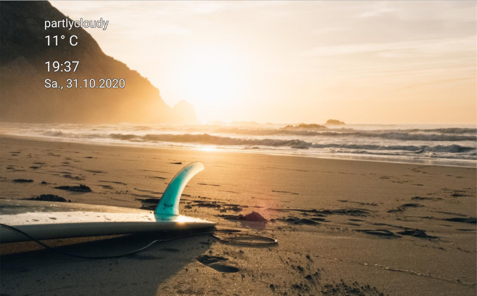

# Lovelace WallPanel
Wall panel mode for your Home Assistant Lovelace dashboards.
Configurable extension which features a fullscreen mode, image screensaver, screen wake lock and the ability to hide side and top bar.



## Installation
1. Download [wallpanel.js](wallpanel.js) and place it into the folder **config/www**.
2. Open Configuration => Lovelace Dashboards => Resources and add **/local/wallpanel.js** (Resource type: **JavaScript module**).

## Upgrading
1. Download current [wallpanel.js](wallpanel.js) and place it into the folder **config/www**.
2. Open Configuration => Lovelace Dashboards => Resources and modify the resource URL to force browsers to reload the resource.
For example you could add or change the query string: **/local/wallpanel.js?v2**

## Configuration
You can set the following configuration parameters for every individual lovelace dashboard:

| Config                  | Description                                                                               | Default |
| ----------------------- | ----------------------------------------------------------------------------------------- | ------- |
| enabled                 | Enable wallpanel? <br>*You will need to set this to **true** to activate the wall panel for the dashboard.* | false   |
| debug                   | Show debug output?                                                                        | false   |
| hide_toolbar            | Hide the upper panel toolbar?                                                             | false   |
| hide_sidebar            | Hide the navigation sidebar?                                                              | false   |
| fullscreen              | Set browser window to fullscreen? <br>*Due to browser restrictions you will need to interact with the screen once to activate fullscreen mode after loading the dashboard page.* | false   |
| idle_time               | Time in seconds after which the screensaver will start (0 = screensaver disabled).        | 15      |
| fade_in_time            | Screensaver fade-in time in seconds.                                                      | 3.0     |
| crossfade_time          | Crossfade duration in seconds for screensaver images.                                     | 3.0     |
| display_time            | Duration in seconds after which the next screensaver image will be shown.                 | 15.0    |
| keep_screen_on_time     | Time in seconds for how long to prevent screen to dimm or lock (0 = disabled). <br>*Due to browser restrictions you will need to interact with the screen once to activate screen wake lock after loading the dashboard page.* | 0       |
| black_screen_after_time | Time in seconds after which the screensaver will show just a black screen (0 = disabled). | 0       |
| image_url               | Fetch screensaver images from this URL. The following variables can be used: <ul><li>${timestamp} = current unix timestamp</li><li>${width} = viewport width</li><li>${height} = viewport height</li></ul> | http://unsplash.it/${width}/${height}?random=${timestamp} |
| image_fit               | Value to be used for the CSS-property 'object-fit' of the images (possible values are: cover / contain / fill / ...). |     cover |
| info_update_interval    | Update interval for the screensaver info box content.                                     |  30     |
|	style                   | Additional CSS styles for wallpanel elements.                                             | {}      |

### Lovelace dashboard yaml
You can add the configuration to your lovelace dashboard configuration yaml (raw config).

**Example**:
```yaml
wallpanel:
  enabled: true
  debug: false
  hide_toolbar: true
  hide_sidebar: true
  fullscreen: true
  idle_time: 10
  image_url: 'http://unsplash.it/${width}/${height}?random=${timestamp}'
  image_fit: cover
  keep_screen_on_time: 86400
  black_screen_after_time: 7200
  style:
    wallpanel-screensaver-info-box:
      font-size: 8vh
      font-weight: 600
      color: '#eeeeee'
      text-shadow: '-2px -2px 0 #03a9f4, 2px -2px 0 #03a9f4, -2px 2px 0 #03a9f4, 2px 2px 0 #03a9f4'
```

### URL query parameters
It is also possible to pass configuration parameters in the query string.
These parameters (**wp_\<parameter\>**) will override the corresponding properties in the yaml configuration.
This will allow you to use device specific settings.
Use JSON syntax for the values.

**Example**:
`http://hass:8123/lovelace/default_view?wp_hide_sidebar=false&wp_idle_time=60&wp_style={"wallpanel-screensaver-info-box":{"font-size":"4vh"}}`

### Activate on individual devices only
1. Set enabled to **false** in your dashboard configuration.
```yaml
wallpanel:
  enabled: false
```
2. Add a query string to the URL to activate on a device:
`http://hass:8123/lovelace/default_view?wp_enabled=true`

# Credits
This project is inspired by:
- https://github.com/tcarlsen/lovelace-screensaver
- https://gist.github.com/ciotlosm/1f09b330aa5bd5ea87b59f33609cc931
- https://github.com/richtr/NoSleep.js
- https://github.com/madeInLagny/mil-no-sleep


