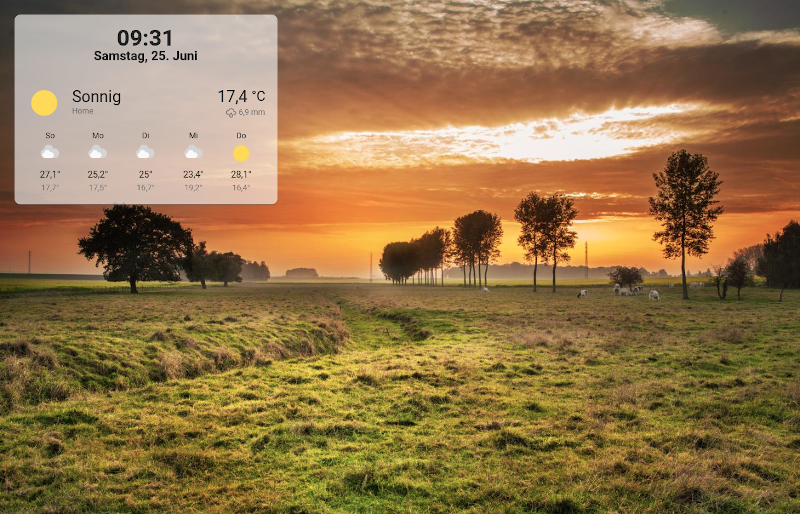
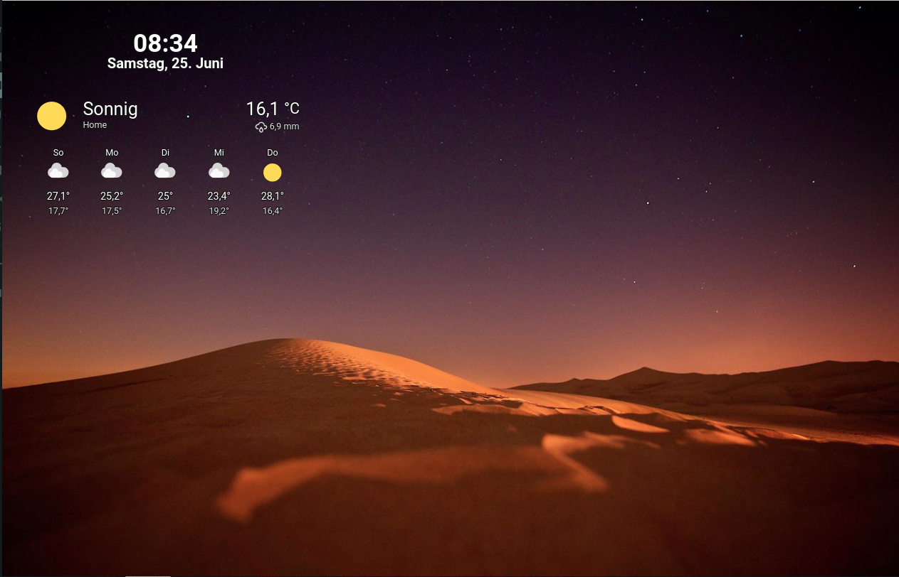

# WallPanel

[](https://github.com/hacs/integration)
[](https://github.com/j-a-n/lovelace-wallpanel/releases)
[](https://github.com/j-a-n/lovelace-wallpanel/stargazers)

🖼️ Wall panel mode for your Home Assistant Dashboards.
Configurable extension which features a fullscreen mode, photo slideshow screensaver, screen wake lock and the ability to hide side and top bar.
Show dashboard cards and badges of your choice on top of the images.



# Installation

The recommended way is to install this plugin using HACS.
## HACS Installation
### Add to custom repositories
* Go to HACS => Frontend
* Click on the three dots in the top right corner
* Select "Custom repositories"
* Insert `https://github.com/j-a-n/lovelace-wallpanel` into repository.
* Select the `Lovelace` as category.
* Click the `ADD` button.

### Install plugin 
* Search for `WallPanel` in the Frontend repository list
* Click on the repository card
* Click on `Install this repository in HACS`
* Select the latest version 
* Click on `Download`


## Manual installation
* Download [wallpanel.js](wallpanel.js) and place it into the folder **config/www**.
* Open Configuration => Lovelace Dashboards => [Resources](https://my.home-assistant.io/redirect/lovelace_resources/) and add **/local/wallpanel.js** (Resource type: **JavaScript module**).


# Upgrading

The recommended way is to upgrade this plugin using HACS.

## HACS upgrade
* Search for `WallPanel` in the Frontend repository list
* Click on the repository card
* Click on `Install this repository in HACS`
* Select the latest version 
* Click on `Download`

## Manual upgrade
* Download current [wallpanel.js](wallpanel.js) and place it into the folder **config/www**.
* Open Configuration => Lovelace Dashboards => [Resources](https://my.home-assistant.io/redirect/lovelace_resources/) and modify the resource URL to force browsers to reload the resource.
For example you could add or change the query string: **/local/wallpanel.js?v2**

# Configuration
You can set the following configuration parameters for every individual Home Assistant Dashboard:

| Config                           | Description                                                                               | Default   |
| -------------------------------- | ----------------------------------------------------------------------------------------- | --------- |
| enabled                          | Enable WallPanel? <br>*You will need to set this to **true** to activate the wall panel for the dashboard.* | false   |
| debug                            | Show debug output?                                                                        | false     |
| hide_toolbar                     | Hide the upper panel toolbar?                                                             | false     |
| hide_sidebar                     | Hide the navigation sidebar?                                                              | false     |
| fullscreen                       | Set browser window to fullscreen? <br>*Due to browser restrictions you will need to interact with the screen once to activate fullscreen mode after loading the dashboard page.* | false   |
| idle_time                        | Time in seconds after which the screensaver will start (0 = screensaver disabled).        | 15        |
| fade_in_time                     | Screensaver fade-in time in seconds.                                                      | 3.0       |
| crossfade_time                   | Crossfade duration in seconds for screensaver images.                                     | 3.0       |
| display_time                     | Duration in seconds after which the next screensaver image will be shown.                 | 15.0      |
| keep_screen_on_time              | Time in seconds for how long to prevent screen to dimm or lock (0 = disabled).            | 0         |
| black_screen_after_time          | Time in seconds after which the screensaver will show just a black screen (0 = disabled). | 0         |
| control_reactivation_time        | Time in seconds for which interaction with the dashboard is disabled after the screensaver is stopped. | 1.0       |
| screensaver_stop_navigation_path | Path to navigate to (e.g., /lovelace/default_view) when screensaver ist stopped.          |           |
| screensaver_entity               | An entity of type 'input_boolean' to reflect and change the screensaver state (on = started, off = stopped). |        |
| image_url                        | Fetch screensaver images from this URL. See below for details.                            | See below |
| image_excludes                   | List of regular expressions for excluding files and directories from local media sources. See below for details. | []        |
| image_fit                        | Value to be used for the CSS-property 'object-fit' of the images (possible values are: cover / contain / fill / ...). | cover |
| image_list_update_interval       | When using a local media source, the image list is updated at this interval.              | 3600       |
| image_order                      | The order in which the images are displayed (possible values are: sorted / random).       | sorted     |
| info_animation_duration_x        | Animation duration in seconds for the movement of the info box in x-direction (0 = no animation). | 0          |
| info_animation_duration_y        | Animation duration in seconds for the movement of the info box in y-direction (0 = no animation). | 0          |
| info_animation_timing_function_x | The CSS timing-function to use for the animation of the info box movemrnt in x-direction. | ease       |
| info_animation_timing_function_y | The CSS timing-function to use for the animation of the info box movemrnt in y-direction. | ease       |
| style                            | Additional CSS styles for wallpanel elements.                                             | {}         |
| badges                           | Badges to display in info box. See below for details.                                     | []         |
| cards                            | Cards to display in info box. See below for details.                                      | See below  |
| profiles                         | Configuration profiles. See below for details.                                            | {}         |
| profile                          | Configuration profile to activate.                                                        |            |
| profile_entity                   | An entity of type 'input_text' used for dynamic activation of profiles.                   |            |

## Home Assistant Dashboard configuration
You can add the configuration to your Home Assistant Dashboard configuration yaml (raw config).

**Short example**:
```yaml
wallpanel:
  enabled: true
  hide_toolbar: true
  hide_sidebar: true
  fullscreen: true
```

**Extended example**:
```yaml
wallpanel:
  enabled: true
  debug: false
  hide_toolbar: true
  hide_sidebar: true
  fullscreen: true
  idle_time: 10
  keep_screen_on_time: 86400
  black_screen_after_time: 7200
  control_reactivation_time: 1.0
  screensaver_stop_navigation_path: /lovelace/default_view 
  image_url: 'http://picsum.photos/${width}/${height}?random=${timestamp}'
  image_fit: cover
  image_list_update_interval: 3600
  image_order: 'sorted'
  image_excludes: []
  screensaver_entity: input_boolean.wallpanel_screensaver
  info_animation_duration_x: 30
  info_animation_duration_y: 11
  info_animation_timing_function_x: 'ease-in-out'
  info_animation_timing_function_y: 'ease-in-out'
  style:
    wallpanel-screensaver-info-box:
      font-size: 8vh
      font-weight: 600
      color: '#eeeeee'
      text-shadow: '-2px -2px 0 #03a9f4, 2px -2px 0 #03a9f4, -2px 2px 0 #03a9f4, 2px 2px 0 #03a9f4'
```

## URL query parameters
It is also possible to pass configuration parameters in the query string.
These parameters (**wp_\<parameter\>**) will override the corresponding properties in the yaml configuration.
This will allow you to use device specific settings.
Use JSON syntax for the values.

**Example**:
`http://hass:8123/lovelace/default_view?wp_hide_sidebar=false&wp_idle_time=60&wp_style={"wallpanel-screensaver-info-box":{"font-size":"4vh"}}`

## Activate on individual devices only
1. Set enabled to **false** in your dashboard configuration.
```yaml
wallpanel:
  enabled: false
```
2. Add a query string to the URL to activate on a device:
`http://hass:8123/lovelace/default_view?wp_enabled=true`


## image_url
Screensaver images will be fetched from this URL.
This can be any HTTP URL or a Home Assistant media-source URL.

The default value is: `http://picsum.photos/${width}/${height}?random=${timestamp}`

The following variables can be used in HTTP URLs:
- `${timestamp}` = current unix timestamp
- `${width}` = viewport width
- `${height}` = viewport height


It is also possible to use images from the Home Assistant Local Media source.
Just set the `image_url` to a media-source URL as displayed in the URL of the Home Assistant Media Browser.
See [Home Assistant Media Source integration documentation](https://www.home-assistant.io/integrations/media_source) for details.

Instead of using `media-source://media_source/` as `image_url` you can just use `/` as a shortcut.

- `/` = Images in all Local Media sources
- `/media1` = Images in the Local Media directory named `media1`
- `/media1/folder1` = Images in `folder1` of the Local Media directory named `media1`

Tip: If you click on the far right side of the screen while the screen saver is active, the next image will be displayed.

## image_excludes
A list of regular expressions which can be used to exclude files and directories from local media sources.

**Example**
```yaml
image_excludes:
  - '\.tif$'
  - '/@eaDir'
```

## Badges and cards
A so-called info box can be displayed above the images.
You can add badges and cards to this box.

You can use the same yaml config, as used in the Home Assistant Dashboard configuration (raw config).

Example (and default) for cards:
```yaml
cards:
  - type: weather-forecast
    entity: weather.home
    show_forecast: true
```

Example for badges:
```yaml
badges:
  - entity: person.somebody
  - entity: sun.sun
```

## Info box animation
The info box, which contains the cards and badges, can be animated and moved around the screen using CSS animations.
The following settings can be used to configure the animation:

**info_animation_duration_x**: How long it will take in seconds to move the info box from one end of the screen to the other in x-direction.
If set to 0, animation in x-direction will be disabled.

**info_animation_duration_y**: Same as above, but in y-direction.


The style of the animation can be configured with **info_animation_timing_function_x** for x-direction and **info_animation_timing_function_y** for the y-direction using a CSS animation-timing-function.

Possible values are, for example, **ease** and **linear**.
For details, please have a look at [MDN - CSS animation-timing-function](https://developer.mozilla.org/de/docs/Web/CSS/animation-timing-function).

An example of a nice animated movement using the Easing function:

```yaml
info_animation_duration_x: 30
info_animation_duration_y: 13
info_animation_timing_function_x: ease-in-out
info_animation_timing_function_y: ease-in-out
```

Be aware that animations increase CPU/GPU usage and power consumption.

A timing function that requires few resources is the step function (`steps(<number-of-steps> [, <step-position> ])`).
You can play with the number of steps to achieve the desired result.
Here is one example in combination with duration settings:

```yaml
info_animation_duration_x: 10
info_animation_duration_y: 20
info_animation_timing_function_x: steps(3, end)
info_animation_timing_function_y: steps(3, end)
```
Fewer steps and higher duration will result in fewer movements and lower resource consumption.


## keep_screen_on_time
If you set this attribute to a value greater than zero, the screen is prevented from dimming or locking for the specified time in seconds.

If supported by the browser, this is done via the Screen Wake Lock API.
The Screen Wake Lock API is usually only available when provided over HTTPS.

If the screen lock API is not available, a short invisible video is played in a loop instead to keep the screen on.
Due to browser limitations, you must interact with the screen once to enable the screen lock after the Dashboard page loads.

## screensaver_entity
You can create an input_boolean helper in HA and set `screensaver_entity` to this entity id.
When the screensaver starts this input_boolean will be set to `on` and to `off` when the screensaver stops.
It is also possible to start and stop the screensaver by changing this input_boolean.

## Styles
You can customize the style of every wallpanel element.

The most important element IDs are:
- `wallpanel-screensaver-container`
- `wallpanel-screensaver-info-box`
- `wallpanel-screensaver-info-box-content`
- `wallpanel-screensaver-overlay`

Use the `style` configuration attribute and add a key for the element ID for which you want to set style attributes.

**Example**

```yaml
style:
  wallpanel-screensaver-overlay:
    background: '#00000055'
  wallpanel-screensaver-info-box-content:
    background: '#ffffff'
```

The following CSS custom properties (variables) can be used to set styles for all added cards, the defaults are:
```yaml
style:
  wallpanel-screensaver-info-box:
    '--wp-card-width': 500px
    '--wp-card-margin': 5px
    '--wp-card-padding': 0px
    '--wp-card-backdrop-filter': none
```
You can add the `wp_style` attribute for individual cards to set CSS styles as needed.

**Example**

```yaml
cards:
  - type: weather-forecast
    entity: weather.home
    wp_style:
      margin-top: 10px
      '--ha-card-background': '#990000'
```

Here are some style examples:

## Dark style
```yaml
style:
  wallpanel-screensaver-info-box:
    '--wp-card-width': 450px
    background-color: '#00000099'
    box-shadow: 0px 2px 1px -1px rgba(0, 0, 0, 0.2), 0px 1px 1px 0px rgba(0, 0, 0, 0.14), 0px 1px 3px 0px rgba(0, 0, 0, 0.12)
  wallpanel-screensaver-info-box-content:
    '--ha-card-background': none
    '--ha-card-box-shadow': none
    '--primary-background-color': '#111111'
    '--secondary-background-color': '#202020'
    '--primary-text-color': '#e1e1e1'
    '--secondary-text-color': '#9b9b9b'
```


## Light style
```yaml
style:
  wallpanel-screensaver-container:
    background-color: '#333333dd'
  wallpanel-screensaver-info-box:
    '--wp-card-width': 450px
    background-color: '#ffffff99'
    box-shadow: 0px 2px 1px -1px rgba(0, 0, 0, 0.2), 0px 1px 1px 0px rgba(0, 0, 0, 0.14), 0px 1px 3px 0px rgba(0, 0, 0, 0.12)
  wallpanel-screensaver-info-box-content:
    '--ha-card-background': none
    '--ha-card-box-shadow': none
    '--primary-background-color': '#fafafa'
    '--secondary-background-color': '#e5e5e5'
    '--primary-text-color': '#212121'
    '--secondary-text-color': '#727272'
```


## Transparent style
```yaml
style:
  wallpanel-screensaver-info-box:
    '--wp-card-width': 450px
  wallpanel-screensaver-info-box-content:
    '--ha-card-background': none
    '--ha-card-box-shadow': none
    text-shadow: -0.5px -0.5px 0 rgb(17, 17, 17), 0.5px -0.5px 0 rgb(17, 17, 17), -0.5px 0.5px 0 rgb(17, 17, 17), 0.5px 0.5px 0 rgb(17, 17, 17)
    '--primary-text-color': '#ffffff'
    '--secondary-text-color': '#dddddd'
```


## Positioning
The cards and badges are positionend by a [Grid_Layout](https://developer.mozilla.org/en-US/docs/Web/CSS/CSS_Grid_Layout).

**Example**

```yaml
  cards:
    - type: markdown
      content: Card 1
      wp_style:
        width: 810px
        grid-row: 1
        grid-column: 1 / span 2
    - type: markdown
      content: Card 2
      wp_style:
        width: 400px
        grid-row: 2
        grid-column: 2
    - type: markdown
      content: Card 3
      wp_style:
        width: 400px
        grid-row: 3
        grid-column: 1
    - type: markdown
      content: Card 4
      wp_style:
        width: 400px
        grid-row: 3
        grid-column: 2
```


## Profiles
With profiles you can easily switch between different configurations. The profiles definition is added at the end of the wallpanel definition. evrything before this section represents the 'standard' or default profile.

**Example**

```yaml
wallpanel:
  enabled: true
  info_animation_duration_x: 30
  info_animation_duration_y: 20
  style:
    wallpanel-screensaver-overlay:
      background: '#00000000'
  profiles:
    night:
      info_animation_duration_x: 0
      info_animation_duration_y: 0
      style:
        wallpanel-screensaver-overlay:
          background: '#000000bb'
    black:
      black_screen_after_time: 1
  profile: night
  profile_entity: input_text.wallpanel_profile
```

The example contains the two (additional) profiles `night` and `black`.
Setting the `profile` configuration to `night` will overwrite the
main (default) configuration with the settings defined in the referenced profile.

There are three different options to activate a profile:

A) Activation by a query string parameter: 
`http://hass:8123/lovelace/default_view?wp_profile="night"`

B) Dynamically activation by using an input_text or input_select helper.
For the example, an input_text helper named `wallpanel_profile` must be created in HA.
The profile can then be changed by setting the status of `input_text.wallpanel_profile` either 
manually or by an (e.g. time based) automation. Changing the value of the helper to the
(exact) name of the profile will change the display immediately. Any value different to
the defined additional profiles will switch back to the default/standard definitions

C) Adding the line profile: (name) to the profile section (second last line in example) however
this may be useful in rare situations only


# Credits
Thanks to Unsplash and to all the photographers for sharing their great photos!

This project is inspired by:
- https://github.com/tcarlsen/lovelace-screensaver
- https://gist.github.com/ciotlosm/1f09b330aa5bd5ea87b59f33609cc931
- https://github.com/richtr/NoSleep.js
- https://github.com/madeInLagny/mil-no-sleep


