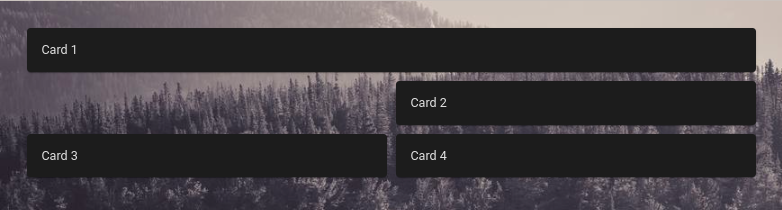

# Info Box
A so-called Info Box can be displayed above the images.
You can add badges, cards and whole dashboard views to this box.

If you want to interact with the elements of the Info Box, as in the dashboard, you can set `card_interaction` to `true`.

```yaml
wallpanel:
  card_interaction: true
```

## Badges
For [Badges](https://www.home-assistant.io/dashboards/badges/) you can use the same yaml config,
as used in the Home Assistant Dashboard configuration (raw config).

Example for Badges:
```yaml
wallpanel:
  badges:
    - entity: person.somebody
    - entity: sun.sun
```

## Cards
For [Cards](https://www.home-assistant.io/dashboards/cards/) you can also use the same yaml config.

Example (and default) for Cards:
```yaml
wallpanel:
  cards:
    - type: weather-forecast
      entity: weather.home
      show_forecast: true
      forecast_type: daily
```

### Positioning
The cards and badges are positionend by a [Grid_Layout](https://developer.mozilla.org/en-US/docs/Web/CSS/CSS_Grid_Layout).

**Example**

```yaml
  cards:
    - type: markdown
      content: Card 1
      wp_style:
        width: 810px
        grid-row: 1
        grid-column: 1 / span 2
    - type: markdown
      content: Card 2
      wp_style:
        width: 400px
        grid-row: 2
        grid-column: 2
    - type: markdown
      content: Card 3
      wp_style:
        width: 400px
        grid-row: 3
        grid-column: 1
    - type: markdown
      content: Card 4
      wp_style:
        width: 400px
        grid-row: 3
        grid-column: 2
```



## Views
You can also display entire Dashboard Views in the info box.
The [Views or Subviews](https://www.home-assistant.io/dashboards/views/) you want to use can be referenced by their `path` or `title`.

For example, you can create a subview in your dashboard with the title `Wallpanel`.
You can then reference the view in the wallpanel configuration:


```yaml
wallpanel:
  cards: []
  views:
    - title: Wallpanel
```

The width of the view can be adjusted using CSS.
The following example uses 80 % of the available width of the viewport:

```yaml
wallpanel:
  cards: []
  views:
    - title: Wallpanel
  style:
    wallpanel-screensaver-info-box-views:
      width: 80vw
```

You can also make the content bigger if required.
For example, enlarge it by 20 %:
```yaml
wallpanel:
  views:
    - title: Wallpanel
  style:
    wallpanel-screensaver-info-box-views:
      transform: scale(1.2)
      transform-origin: top center
```

To utilize the full screen width and height for one single view and remove any extra padding, apply the following:
```yaml
wallpanel:
  views:
    - title: Wallpanel
      wp_style:
        height: 100vh
        width: 100vw
  cards: []
  style:
    wallpanel-screensaver-info-container:
      padding: 0px
    wallpanel-screensaver-info-box-views:
      width: 100vw
      height: 100vh
```


## Info Box animation
The info box, which contains the cards and badges, can be animated and moved around the screen using CSS animations.
The following settings can be used to configure the animation:

**info_animation_duration_x**: How long it will take in seconds to move the info box from one end of the screen to the other in x-direction.
If set to 0, animation in x-direction will be disabled.

**info_animation_duration_y**: Same as above, but in y-direction.


The style of the animation can be configured with **info_animation_timing_function_x** for x-direction and **info_animation_timing_function_y** for the y-direction using a CSS animation-timing-function.

Possible values are, for example, **ease** and **linear**.
For details, please have a look at [MDN - CSS animation-timing-function](https://developer.mozilla.org/docs/Web/CSS/animation-timing-function).

An example of a nice animated movement using the Easing function:

```yaml
info_animation_duration_x: 30
info_animation_duration_y: 13
info_animation_timing_function_x: ease-in-out
info_animation_timing_function_y: ease-in-out
```

Be aware that animations increase CPU/GPU usage and power consumption.

A timing function that requires few resources is the step function (`steps(<number-of-steps> [, <step-position> ])`).
You can play with the number of steps to achieve the desired result.
Here is one example in combination with duration settings:

```yaml
info_animation_duration_x: 10
info_animation_duration_y: 20
info_animation_timing_function_x: steps(3, end)
info_animation_timing_function_y: steps(3, end)
```
Fewer steps and higher duration will result in fewer movements and lower resource consumption.


In addition, it is possible to move the info box to a random position on the screen or around corners of the screen (ie. top left, bottom left, bottom right, top right, and so forth), at a fixed time interval.

**Example**

```yaml
info_move_pattern: random
info_move_interval: 10
info_move_fade_duration: 2.0
```
