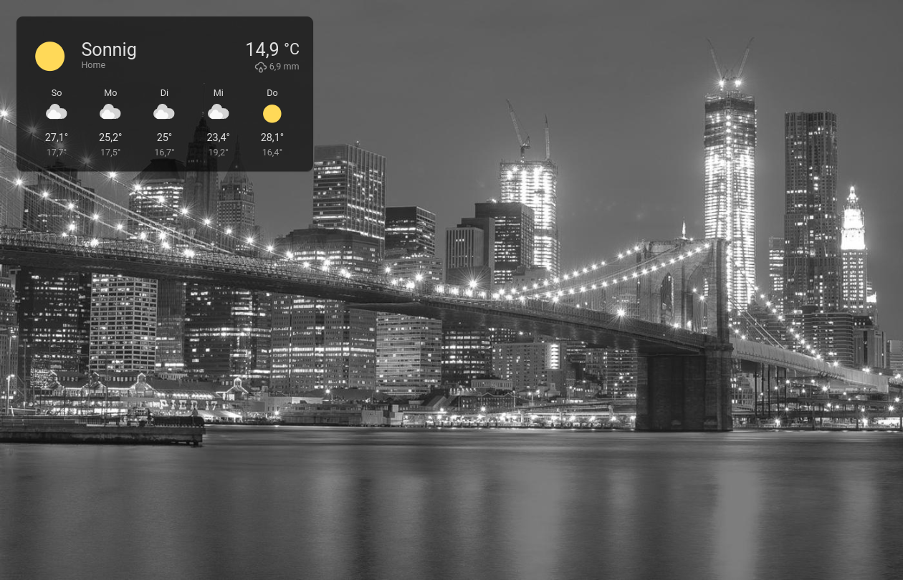
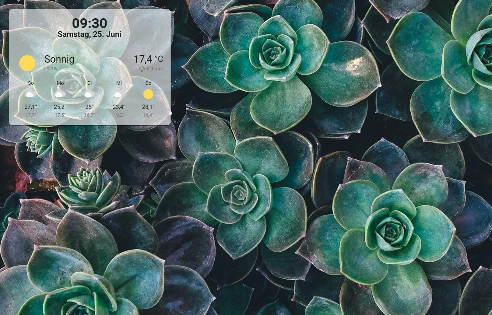

# Styling
You can customize the style of every WallPanel element.

The most important element IDs are:

- `wallpanel-screensaver-container`
- `wallpanel-screensaver-info-box`
- `wallpanel-screensaver-info-box-content`
- `wallpanel-screensaver-info-box-badges`
- `wallpanel-screensaver-info-box-views`
- `wallpanel-screensaver-image-background`
- `wallpanel-screensaver-image-info`
- `wallpanel-screensaver-image-overlay`
- `wallpanel-screensaver-overlay`

Use the `style` configuration attribute and add a key for the element ID for which you want to set style attributes.

**Example**

```yaml
style:
  wallpanel-screensaver-overlay:
    background: '#00000055'
  wallpanel-screensaver-info-box-content:
    background: '#ffffff'
```

The following CSS custom properties (variables) can be used to set styles for all added cards, the defaults are:
```yaml
style:
  wallpanel-screensaver-info-box:
    '--wp-card-width': 500px
    '--wp-card-margin': 5px
    '--wp-card-padding': 0px
    '--wp-card-backdrop-filter': none
```
You can add the `wp_style` attribute for individual cards and badges to set CSS styles as needed.

**Example**

```yaml
cards:
  - type: weather-forecast
    entity: weather.home
    wp_style:
      margin-top: 10px
      '--ha-card-background': '#990000'
```

The CSS class `wallpanel-screensaver-image-info` can be used to style the image info layer.

**Example and default:**
```yaml
style:
  wallpanel-screensaver-image-info:
    position: 'absolute'
    bottom: '0.5em'
    right: '0.5em'
    padding: '0.1em 0.5em 0.1em 0.5em'
    font-size: '2em'
    background: '#00000055'
    backdrop-filter: 'blur(2px)'
    border-radius: '0.1em'
```

**Another example:**
```yaml
style:
  wallpanel-screensaver-image-info:
    position: 'absolute'
    bottom: '0.5em'
    right: '1.0em'
    font-size: '2.5em'
    -webkit-text-stroke: '0.02em #000'
    color: '#ff9a00'
    font-weight: '900'
    font-family: 'monospace'
```

Here are some style examples:

## Dark style
```yaml
style:
  wallpanel-screensaver-info-box:
    '--wp-card-width': 450px
    background-color: '#00000099'
    box-shadow: 0px 2px 1px -1px rgba(0, 0, 0, 0.2), 0px 1px 1px 0px rgba(0, 0, 0, 0.14), 0px 1px 3px 0px rgba(0, 0, 0, 0.12)
  wallpanel-screensaver-info-box-content:
    '--ha-card-background': none
    '--ha-card-box-shadow': none
    '--ha-card-border-width': 0px
    '--primary-background-color': '#111111'
    '--secondary-background-color': '#202020'
    '--primary-text-color': '#e1e1e1'
    '--secondary-text-color': '#9b9b9b'
```


## Light style
```yaml
style:
  wallpanel-screensaver-container:
    background-color: '#333333dd'
  wallpanel-screensaver-info-box:
    '--wp-card-width': 450px
    background-color: '#ffffff99'
    box-shadow: 0px 2px 1px -1px rgba(0, 0, 0, 0.2), 0px 1px 1px 0px rgba(0, 0, 0, 0.14), 0px 1px 3px 0px rgba(0, 0, 0, 0.12)
  wallpanel-screensaver-info-box-content:
    '--ha-card-background': none
    '--ha-card-box-shadow': none
    '--ha-card-border-width': 0px
    '--primary-background-color': '#fafafa'
    '--secondary-background-color': '#e5e5e5'
    '--primary-text-color': '#212121'
    '--secondary-text-color': '#727272'
```


## Transparent style
```yaml
style:
  wallpanel-screensaver-info-box:
    '--wp-card-width': 450px
  wallpanel-screensaver-info-box-content:
    '--ha-card-background': none
    '--ha-card-box-shadow': none
    '--ha-card-border-width': 0px
    text-shadow: -0.5px -0.5px 0 rgb(17, 17, 17), 0.5px -0.5px 0 rgb(17, 17, 17), -0.5px 0.5px 0 rgb(17, 17, 17), 0.5px 0.5px 0 rgb(17, 17, 17)
    '--primary-text-color': '#ffffff'
    '--secondary-text-color': '#dddddd'
```


## Alternative transparent style with text shadow
```yaml
style:
  wallpanel-screensaver-info-box-content:
    '--ha-card-background': none
    '--ha-card-box-shadow': none
    '--ha-card-border-width': 0px
    '--primary-text-color': '#ffffff'
    '--secondary-text-color': '#dddddd'
    filter: 'drop-shadow(0px 0px 3px rgb(17, 17, 17)) drop-shadow(0px 0px 8px rgb(30, 30, 30))'
```